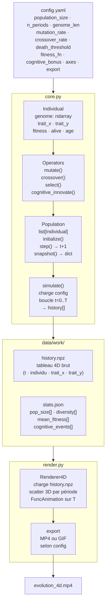

# Natural-selection (à actualiser!)

Simulation d'évolution de population sous sélection naturelle, visualisée en 4D.  
X = trait phénotypique A · Y = trait phénotypique B · Z = fitness moyen · T = temps (animation)

---

## Stack

- Python 3.10+
- `numpy` — génomes, calculs vectorisés
- `matplotlib` — scatter 3D + FuncAnimation
- `pyyaml` — lecture config
- `pytest` — tests
- `ffmpeg-python` — export MP4

---

## Structure

```
evo4d/
├── config.yaml          ← unique source de vérité (paramètres bio + viz)
├── Makefile             ← point d'entrée unique
├── requirements.txt
├── .gitignore
├── src/
│   ├── core.py          ← Individual, Operators, Population, simulate()
│   └── render.py        ← Renderer4D, FuncAnimation, export
├── tests/
│   └── tests.py         ← tous les tests pytest
└── data/
    ├── raw/             ← versionné (configs expérimentales)
    └── work/            ← gitignore (artefacts générés)
        ├── history.npz
        ├── stats.json
        └── evolution_4d.mp4
```

---

## Pipeline



---

## Config

```yaml
# config.yaml

population:
  size: 200
  genome_len: 32

simulation:
  n_periods: 100
  death_threshold: 0.2
  fitness_fn: "quadratic"       # quadratic | plateau | rugged

operators:
  mutation_rate: 0.01
  crossover_rate: 0.7
  cognitive_bonus: 0.15         # bonus fitness pour innovation cognitive

visualization:
  axes:
    x: trait_x
    y: trait_y
    z: fitness
  export: mp4                   # mp4 | gif
```

---

## Conventions

- `data/work/` reçoit tous les artefacts intermédiaires — ne jamais versionner.
- `data/raw/` contient les configs d'expériences reproductibles — versionné.
- Un module par responsabilité : `core.py` compute, `render.py` affiche. Aucune logique biologique dans le renderer.
- Ajouter un mécanisme (prédation, migration, épigénétique) = ajouter une méthode dans `Operators` ou `Population`, sans toucher au reste.
- `simulate()` est le seul point d'entrée de la simulation. Il lit `config.yaml` et écrit dans `data/work/`.

---

## Lancement

```bash
make install    # installe les dépendances
make run        # simulate() + render() en séquence
make test       # pytest tests/
make render     # render seul (si history.npz existe déjà)
make clean      # vide data/work/
make all        # install + run
```

Ou étape par étape :

```bash
python -m src.core      # simulation seule → history.npz + stats.json
python -m src.render    # rendu seul       → evolution_4d.mp4
```

---

## Extensibilité

Le projet est conçu pour accueillir des ramifications sans restructuration :

| Ajout envisagé | Où intervenir |
|---|---|
| Nouvelle fonction de fitness | `config.yaml` + `Operators.score()` |
| Mécanisme de prédation | `Population.step()` |
| Migration entre sous-populations | nouvelle méthode `Population.migrate()` |
| Épigénétique | `Individual` + flag dans le génome |
| Visualisation alternative | nouveau fichier `src/render_alt.py` |
| Export CSV des stats | `simulate()` → `stats.json` déjà prévu |